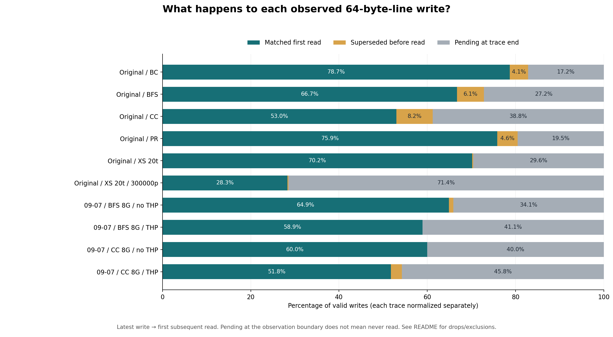

# Write-to-read analysis results

10 distinct full traces analyzed; 22,337,500,928 valid accesses. Coverage is **partial** relative to all discovered paths: 3 invalid inputs, 0 failed/incomplete results, 1 duplicate aliases excluded.

These are 64-byte **latest-write → first-subsequent-read** observations, not cache hits or read latencies. The source trace timestamps are interpreted as 400-MHz cycles.



## Per-trace summary

Write fractions use all valid writes. Time and operation means use matched pairs only.

| Trace / charts | Matched writes | Match rate | Superseded | Pending at end | Mean time (cycles) | Mean time (s) | Mean intervening operations | Collector drops |
|---|---:|---:|---:|---:|---:|---:|---:|---:|
| [Original / BC](r0_bc_81b06a15ad/README.md) | 641,287,948 | 78.72% | 4.095% | 17.18% | 157,350,687 | 0.393 | 65,941,981 | 1,040 |
| [Original / BFS](r0_bfs_f5c070eb98/README.md) | 209,574,211 | 66.74% | 6.075% | 27.19% | 452,019,803 | 1.130 | 152,066,646 | 0 |
| [Original / CC](r0_cc_3cd2baf7ac/README.md) | 197,789,959 | 52.98% | 8.235% | 38.78% | 716,830,844 | 1.792 | 185,355,280 | 9,345 |
| [Original / PR](r0_pr_b8e5f78041/README.md) | 252,741,568 | 75.88% | 4.604% | 19.51% | 518,064,563 | 1.295 | 155,864,501 | 583,273,912 |
| [Original / XS 20t](r0_xs_20t_1fed27b3cc/README.md) | 37,376,293 | 70.18% | 0.238% | 29.58% | 2,228,784,026 | 5.572 | 1,274,600,518 | 742,705,516 |
| [Original / XS 20t / 300000p](r0_xs_20t_300000p_3868b65f34/README.md) | 14,939,301 | 28.32% | 0.239% | 71.44% | 604,368,077 | 1.511 | 242,253,504 | 0 |
| [09-07 / BFS 8G / no THP](r1_trace_09_07_bfs_8g_noTHP_1d3fc83cc2/README.md) | 74,479,560 | 64.89% | 1.021% | 34.09% | 742,000,649 | 1.855 | 105,908,120 | 0 |
| [09-07 / BFS 8G / THP](r1_trace_09_07_bfs_8g_withTHP_467813de1b/README.md) | 46,916,346 | 58.92% | 0.003% | 41.07% | 494,437,754 | 1.236 | 79,831,229 | 0 |
| [09-07 / CC 8G / no THP](r1_trace_09_07_cc_8g_noTHP_25fca2b541/README.md) | 80,666,955 | 60.01% | 0.003% | 39.99% | 639,940,694 | 1.600 | 76,109,334 | 0 |
| [09-07 / CC 8G / THP](r1_trace_09_07_cc_8g_withTHP_484755becf/README.md) | 34,470,184 | 51.78% | 2.465% | 45.75% | 370,763,790 | 0.927 | 55,242,228 | 0 |

## Pooled result

1,590,242,325 matched pairs from 2,336,407,811 writes: **68.06% matched**, 4.35% superseded, 27.59% pending at end.


[Pooled tables and percentile intervals](pooled/README.md).

Pooling sums integer counters, histogram counts, and exact distance sums before computing rates, means, or percentile intervals. No per-trace percentages are averaged. Trace boundaries remain independent; there is no matching across files. Pooled figures reflect this workload mixture, not a universal workload.

## Short-distance fractions

Each entry is the percentage of **matched pairs**, at exact power-of-two bin boundaries. `2^10` cycles = 2.56 μs; `2^20` cycles = 2.62144 ms. Operation thresholds count observed traffic across both channels, not unique lines.

| Trace | Time < 2^10 cycles | Time < 2^20 cycles | Operations < 2^10 | Operations < 2^20 |
|---|---:|---:|---:|---:|
| Original / BC | 0.0102% | 7.0735% | 0.0190% | 11.4944% |
| Original / BFS | 0.0054% | 2.2508% | 0.0148% | 4.2935% |
| Original / CC | 0.0094% | 5.1331% | 0.0232% | 7.0420% |
| Original / PR | 0.0095% | 3.4422% | 0.0264% | 5.4222% |
| Original / XS 20t | 0.0027% | 1.7116% | 0.0039% | 2.3736% |
| Original / XS 20t / 300000p | 0.0055% | 3.9836% | 0.0085% | 5.5553% |
| 09-07 / BFS 8G / no THP | 0.0075% | 3.8175% | 0.0637% | 10.4897% |
| 09-07 / BFS 8G / THP | 0.0375% | 32.5419% | 0.8303% | 37.3373% |
| 09-07 / CC 8G / no THP | 0.0066% | 2.6284% | 0.0787% | 11.5891% |
| 09-07 / CC 8G / THP | 0.0159% | 33.2175% | 0.8070% | 38.7576% |
| Pooled | 0.0098% | 6.4045% | 0.0658% | 10.0675% |

## Coverage and interpretation limits

- Pending writes at end are right-censored; the trace cannot establish whether they are read later.
- Supersession is line-granular; a read could consume bytes from several writes. These are not per-byte dependence counts.
- Collector drops can hide reads, writes, and supersession. Their bias is not necessarily one-directional.
- Histogram percentiles are bin intervals, not exact sample percentiles. Exact minima, maxima, and sums are retained.
- Time distance is elapsed time between recorded accesses, not memory-service latency. Intervening operations are not cache reuse distance.
- New THP/no-THP traces are separate recorded runs. Observed differences alone do not prove THP caused them.
- 44 invalid slots were skipped; 1,325,989,813 collector-dropped accesses were reported across included traces.

| Input | Status | Reason |
|---|---|---|
| `/research/yans3/trace/bc.bin` | duplicate_alias | Duplicate of r0_bc_81b06a15ad |
| `/research/yans3/trace/trace_09_07/bc_8g_noTHP.bin` | invalid_input | header implies 42949672992 bytes; actual 15393095680 |
| `/research/yans3/trace/trace_09_07/bc_8g_withTHP.bin` | invalid_input | header implies 42949673056 bytes; actual 15103688704 |
| `/research/yans3/trace/trace_09_07/pr_8g_withTHP.bin` | invalid_input | header implies 42949672992 bytes; actual 15036579840 |

## Reproduction and data

Run locally from the repository root, using a fresh output directory:

```sh
python3 scripts/plot_results.py \
  --run-dir /research/yans3/gitdoc/tracing_analysis/out/write_read_all_20260927_retry1 \
  --output docs/results/write_read_new
```

No Slurm jobs or raw-bin reads are needed. Matplotlib renders PNGs using the noninteractive Agg backend. The publisher validates full-trace markers, metadata/digests, counters, channel totals, CSV bins, and percentile intervals before rendering. It follows `reused_result` references and excludes duplicates. Failed/incomplete results reject publication unless `--allow-partial` is explicitly requested. It refuses to overwrite an existing publication.

[All trace/channel rows](summary.csv) · [Coverage manifest](coverage.json) · [Provenance and source hashes](provenance.json) · [Launch manifest snapshot](source_manifest.json) · [Publisher script snapshot](plot_results.py).

Every trace subdirectory contains portable JSON/CSV snapshots, two PNGs, and a README. The `PUBLICATION_COMPLETE` marker is emitted only when the complete publication succeeds.
