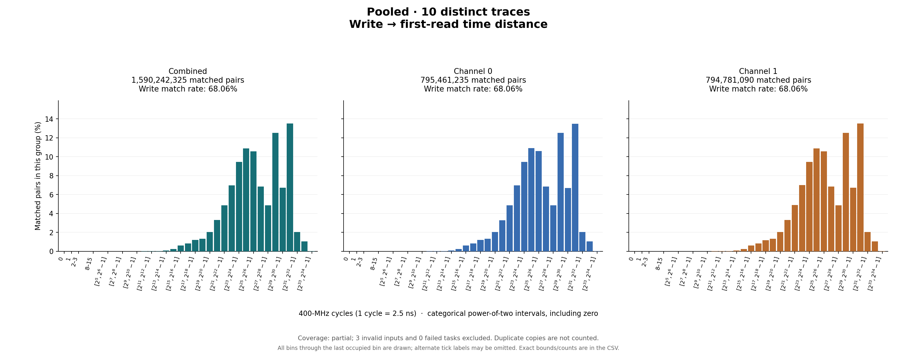
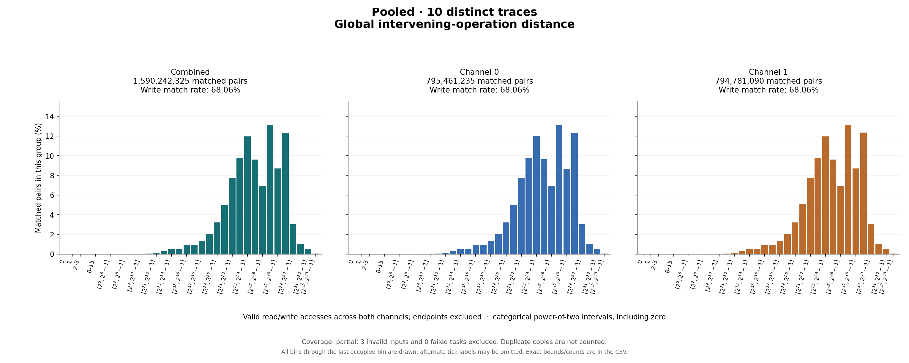

# Pooled result

Coverage: partial

## Write outcomes

| Group | Writes | Matched | Match rate | Superseded | Pending at end | Reads without pending write |
|---|---:|---:|---:|---:|---:|---:|
| combined | 2,336,407,811 | 1,590,242,325 | 68.06% | 101,585,762 | 644,579,724 | 18,410,850,792 |
| channel_0 | 1,168,687,336 | 795,461,235 | 68.06% | 50,856,069 | 322,370,032 | 9,188,283,487 |
| channel_1 | 1,167,720,475 | 794,781,090 | 68.06% | 50,729,693 | 322,209,692 | 9,222,567,305 |

## Matched-pair distances (combined)

| Metric | Exact minimum | Mean | Exact maximum | P50 interval | P90 interval | P95 interval | P99 interval |
|---|---:|---:|---:|---|---|---|---|
| time_cycles | 2 | 442,418,840.112 | 14,039,251,672 | [33,554,432, 67,108,863] | [1,073,741,824, 2,147,483,647] | [1,073,741,824, 2,147,483,647] | [4,294,967,296, 8,589,934,591] |
| intervening_operations | 0 | 139,065,557.214 | 4,696,953,628 | [16,777,216, 33,554,431] | [268,435,456, 536,870,911] | [268,435,456, 536,870,911] | [1,073,741,824, 2,147,483,647] |

Percentiles are nearest-rank **bin intervals**, not exact values. Histograms contain matched pairs only; write match rates include superseded and pending writes in the denominator.

Raw slots: 22,337,500,972; valid accesses: 22,337,500,928; invalid slots: 44.

Data: [summary JSON](summary.json), [summary CSV](summary.csv), [time bins](time_histogram.csv), [operation bins](intervening_operations_histogram.csv).

[Back to results](../README.md).
