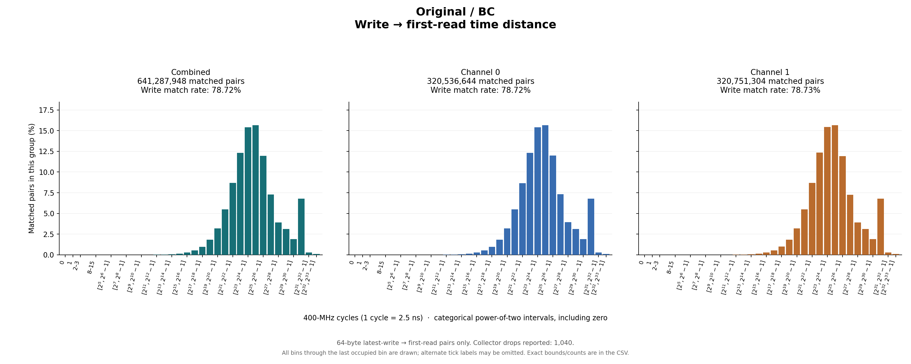
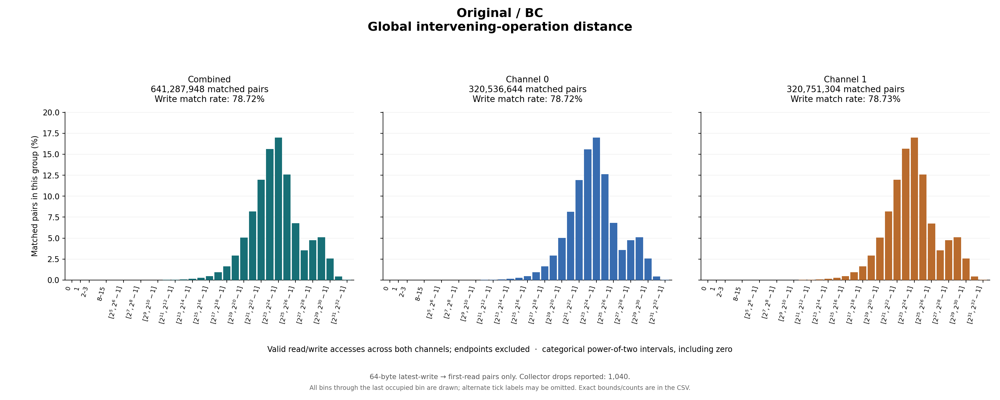

# Original / BC

64-byte latest-write → first-read pairs only. Collector drops reported: 1,040.

## Write outcomes

| Group | Writes | Matched | Match rate | Superseded | Pending at end | Reads without pending write |
|---|---:|---:|---:|---:|---:|---:|
| combined | 814,599,808 | 641,287,948 | 78.72% | 33,357,725 | 139,954,135 | 2,422,335,540 |
| channel_0 | 407,198,649 | 320,536,644 | 78.72% | 16,677,164 | 69,984,841 | 1,208,478,735 |
| channel_1 | 407,401,159 | 320,751,304 | 78.73% | 16,680,561 | 69,969,294 | 1,213,856,805 |

## Matched-pair distances (combined)

| Metric | Exact minimum | Mean | Exact maximum | P50 interval | P90 interval | P95 interval | P99 interval |
|---|---:|---:|---:|---|---|---|---|
| time_cycles | 2 | 157,350,686.709 | 7,106,331,722 | [16,777,216, 33,554,431] | [268,435,456, 536,870,911] | [1,073,741,824, 2,147,483,647] | [1,073,741,824, 2,147,483,647] |
| intervening_operations | 0 | 65,941,981.102 | 3,541,750,256 | [8,388,608, 16,777,215] | [134,217,728, 268,435,455] | [268,435,456, 536,870,911] | [536,870,912, 1,073,741,823] |

Percentiles are nearest-rank **bin intervals**, not exact values. Histograms contain matched pairs only; write match rates include superseded and pending writes in the denominator.

Raw slots: 3,878,223,310; valid accesses: 3,878,223,296; invalid slots: 14.

Data: [summary JSON](summary.json), [summary CSV](summary.csv), [time bins](time_histogram.csv), [operation bins](intervening_operations_histogram.csv).

[Back to results](../README.md).

Original result directory: `/research/yans3/gitdoc/tracing_analysis/out/write_read_all_20260927_retry1/results/r0_bc_81b06a15ad`.
Input: `/research/yans3/gitdoc/remap_tracing/bc.bin`.
Input SHA-256: `31088e0066d53ece7978d85168b1e40e09238a2e31ce2578b27a1810bd7d86de`.
