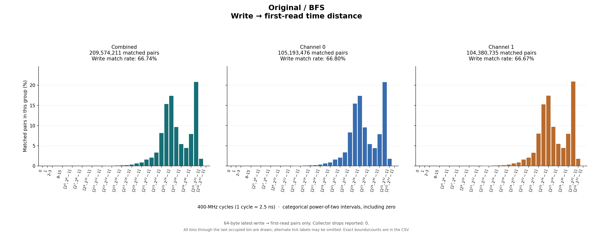
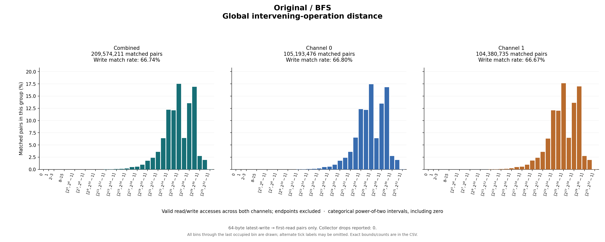

# Original / BFS

64-byte latest-write → first-read pairs only. Collector drops reported: 0.

## Write outcomes

| Group | Writes | Matched | Match rate | Superseded | Pending at end | Reads without pending write |
|---|---:|---:|---:|---:|---:|---:|
| combined | 314,036,186 | 209,574,211 | 66.74% | 19,078,874 | 85,383,101 | 1,942,527,011 |
| channel_0 | 157,469,413 | 105,193,476 | 66.80% | 9,565,563 | 42,710,374 | 969,164,860 |
| channel_1 | 156,566,773 | 104,380,735 | 66.67% | 9,513,311 | 42,672,727 | 973,362,151 |

## Matched-pair distances (combined)

| Metric | Exact minimum | Mean | Exact maximum | P50 interval | P90 interval | P95 interval | P99 interval |
|---|---:|---:|---:|---|---|---|---|
| time_cycles | 12 | 452,019,803.340 | 4,749,853,430 | [33,554,432, 67,108,863] | [1,073,741,824, 2,147,483,647] | [1,073,741,824, 2,147,483,647] | [2,147,483,648, 4,294,967,295] |
| intervening_operations | 0 | 152,066,646.301 | 2,449,749,225 | [33,554,432, 67,108,863] | [268,435,456, 536,870,911] | [268,435,456, 536,870,911] | [1,073,741,824, 2,147,483,647] |

Percentiles are nearest-rank **bin intervals**, not exact values. Histograms contain matched pairs only; write match rates include superseded and pending writes in the denominator.

Raw slots: 2,466,137,408; valid accesses: 2,466,137,408; invalid slots: 0.

Data: [summary JSON](summary.json), [summary CSV](summary.csv), [time bins](time_histogram.csv), [operation bins](intervening_operations_histogram.csv).

[Back to results](../README.md).

Original result directory: `/research/yans3/gitdoc/tracing_analysis/out/write_read_all_20260927_v1/results/r0_bfs_f5c070eb98`.
Input: `/research/yans3/gitdoc/remap_tracing/bfs.bin`.
Input SHA-256: `ea916562e67868be26191cd2c35cbee900a196794bc607337a1018a33faf2785`.
