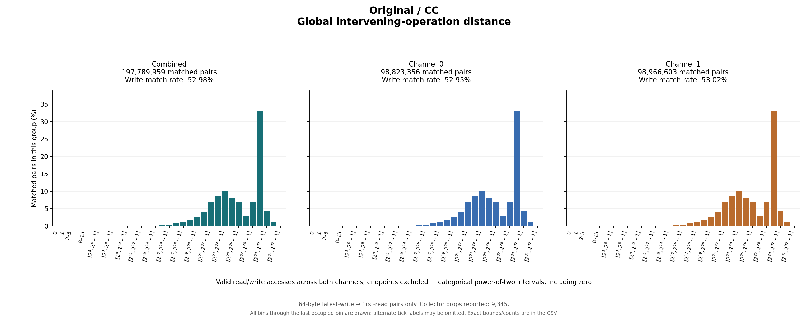

# Original / CC

64-byte latest-write → first-read pairs only. Collector drops reported: 9,345.

## Write outcomes

| Group | Writes | Matched | Match rate | Superseded | Pending at end | Reads without pending write |
|---|---:|---:|---:|---:|---:|---:|
| combined | 373,302,863 | 197,789,959 | 52.98% | 30,742,027 | 144,770,877 | 1,862,981,642 |
| channel_0 | 186,649,199 | 98,823,356 | 52.95% | 15,407,918 | 72,417,925 | 929,767,698 |
| channel_1 | 186,653,664 | 98,966,603 | 53.02% | 15,334,109 | 72,352,952 | 933,213,944 |

## Matched-pair distances (combined)

| Metric | Exact minimum | Mean | Exact maximum | P50 interval | P90 interval | P95 interval | P99 interval |
|---|---:|---:|---:|---|---|---|---|
| time_cycles | 8 | 716,830,843.855 | 4,991,533,195 | [67,108,864, 134,217,727] | [1,073,741,824, 2,147,483,647] | [2,147,483,648, 4,294,967,295] | [2,147,483,648, 4,294,967,295] |
| intervening_operations | 1 | 185,355,280.126 | 2,418,739,497 | [33,554,432, 67,108,863] | [268,435,456, 536,870,911] | [536,870,912, 1,073,741,823] | [1,073,741,824, 2,147,483,647] |

Percentiles are nearest-rank **bin intervals**, not exact values. Histograms contain matched pairs only; write match rates include superseded and pending writes in the denominator.

Raw slots: 2,434,074,494; valid accesses: 2,434,074,464; invalid slots: 30.

Data: [summary JSON](summary.json), [summary CSV](summary.csv), [time bins](time_histogram.csv), [operation bins](intervening_operations_histogram.csv).

[Back to results](../README.md).

Original result directory: `/research/yans3/gitdoc/tracing_analysis/out/write_read_all_20260927_v1/results/r0_cc_3cd2baf7ac`.
Input: `/research/yans3/gitdoc/remap_tracing/cc.bin`.
Input SHA-256: `3e235df56e6725afb1d980f4cc7f2a9267a381962f7d884508806d5fc9649208`.
