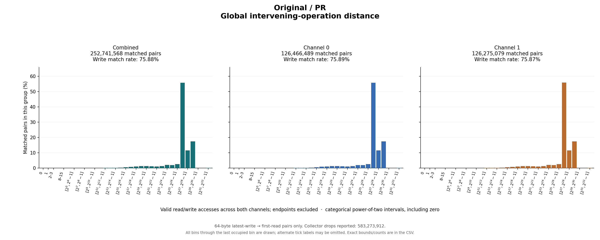

# Original / PR

64-byte latest-write → first-read pairs only. Collector drops reported: 583,273,912.

## Write outcomes

| Group | Writes | Matched | Match rate | Superseded | Pending at end | Reads without pending write |
|---|---:|---:|---:|---:|---:|---:|
| combined | 333,070,810 | 252,741,568 | 75.88% | 15,334,826 | 64,994,416 | 4,111,808,102 |
| channel_0 | 166,641,667 | 126,466,489 | 75.89% | 7,679,381 | 32,495,797 | 2,056,130,796 |
| channel_1 | 166,429,143 | 126,275,079 | 75.87% | 7,655,445 | 32,498,619 | 2,055,677,306 |

## Matched-pair distances (combined)

| Metric | Exact minimum | Mean | Exact maximum | P50 interval | P90 interval | P95 interval | P99 interval |
|---|---:|---:|---:|---|---|---|---|
| time_cycles | 33 | 518,064,562.541 | 14,039,251,672 | [268,435,456, 536,870,911] | [1,073,741,824, 2,147,483,647] | [1,073,741,824, 2,147,483,647] | [1,073,741,824, 2,147,483,647] |
| intervening_operations | 2 | 155,864,501.049 | 4,273,420,186 | [67,108,864, 134,217,727] | [268,435,456, 536,870,911] | [268,435,456, 536,870,911] | [268,435,456, 536,870,911] |

Percentiles are nearest-rank **bin intervals**, not exact values. Histograms contain matched pairs only; write match rates include superseded and pending writes in the denominator.

Raw slots: 4,697,620,480; valid accesses: 4,697,620,480; invalid slots: 0.

Data: [summary JSON](summary.json), [summary CSV](summary.csv), [time bins](time_histogram.csv), [operation bins](intervening_operations_histogram.csv).

[Back to results](../README.md).

Original result directory: `/research/yans3/gitdoc/tracing_analysis/out/write_read_all_20260927_v1/results/r0_pr_b8e5f78041`.
Input: `/research/yans3/gitdoc/remap_tracing/pr.bin`.
Input SHA-256: `ca85419305b17ab19a4b19b5e905b395052fc0bdfd6ed2ffb8d33564198596a8`.
