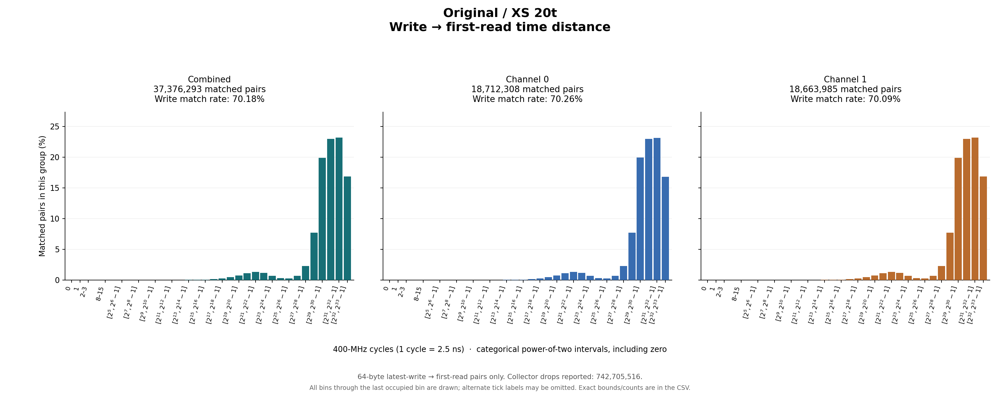
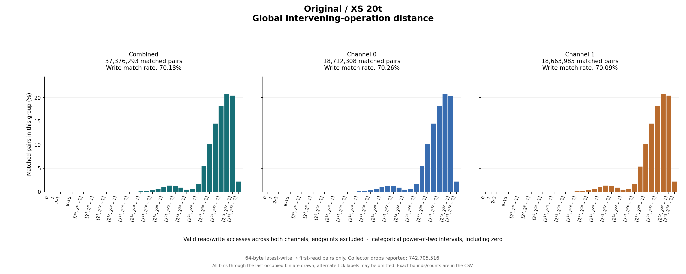

# Original / XS 20t

64-byte latest-write → first-read pairs only. Collector drops reported: 742,705,516.

## Write outcomes

| Group | Writes | Matched | Match rate | Superseded | Pending at end | Reads without pending write |
|---|---:|---:|---:|---:|---:|---:|
| combined | 53,259,450 | 37,376,293 | 70.18% | 126,957 | 15,756,200 | 4,606,984,737 |
| channel_0 | 26,631,665 | 18,712,308 | 70.26% | 63,302 | 7,856,055 | 2,297,704,889 |
| channel_1 | 26,627,785 | 18,663,985 | 70.09% | 63,655 | 7,900,145 | 2,309,279,848 |

## Matched-pair distances (combined)

| Metric | Exact minimum | Mean | Exact maximum | P50 interval | P90 interval | P95 interval | P99 interval |
|---|---:|---:|---:|---|---|---|---|
| time_cycles | 37 | 2,228,784,025.786 | 7,831,771,502 | [1,073,741,824, 2,147,483,647] | [4,294,967,296, 8,589,934,591] | [4,294,967,296, 8,589,934,591] | [4,294,967,296, 8,589,934,591] |
| intervening_operations | 4 | 1,274,600,517.807 | 4,696,953,628 | [536,870,912, 1,073,741,823] | [2,147,483,648, 4,294,967,295] | [2,147,483,648, 4,294,967,295] | [4,294,967,296, 8,589,934,591] |

Percentiles are nearest-rank **bin intervals**, not exact values. Histograms contain matched pairs only; write match rates include superseded and pending writes in the denominator.

Raw slots: 4,697,620,480; valid accesses: 4,697,620,480; invalid slots: 0.

Data: [summary JSON](summary.json), [summary CSV](summary.csv), [time bins](time_histogram.csv), [operation bins](intervening_operations_histogram.csv).

[Back to results](../README.md).

Original result directory: `/research/yans3/gitdoc/tracing_analysis/out/write_read_all_20260927_retry1/results/r0_xs_20t_1fed27b3cc`.
Input: `/research/yans3/gitdoc/remap_tracing/xs_20t.bin`.
Input SHA-256: `3bec11d79b25fdc76e9342e5dea70dd530f6a7a3eb0f98f55dad01676216ac81`.
