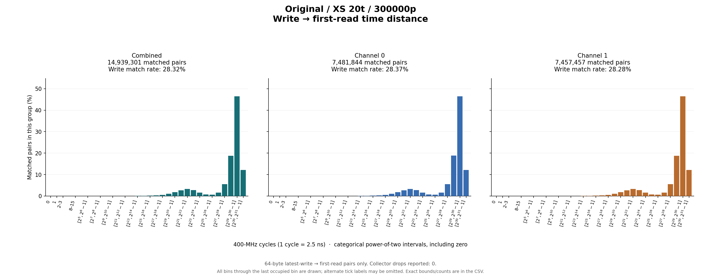
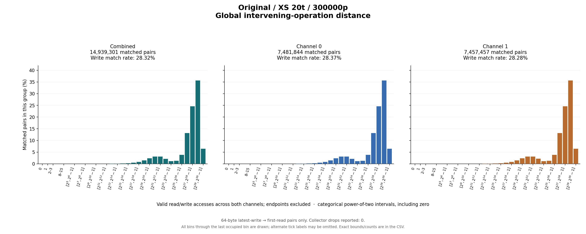

# Original / XS 20t / 300000p

64-byte latest-write → first-read pairs only. Collector drops reported: 0.

## Write outcomes

| Group | Writes | Matched | Match rate | Superseded | Pending at end | Reads without pending write |
|---|---:|---:|---:|---:|---:|---:|
| combined | 52,746,374 | 14,939,301 | 28.32% | 125,874 | 37,681,199 | 580,961,269 |
| channel_0 | 26,372,885 | 7,481,844 | 28.37% | 62,897 | 18,828,144 | 289,818,035 |
| channel_1 | 26,373,489 | 7,457,457 | 28.28% | 62,977 | 18,853,055 | 291,143,234 |

## Matched-pair distances (combined)

| Metric | Exact minimum | Mean | Exact maximum | P50 interval | P90 interval | P95 interval | P99 interval |
|---|---:|---:|---:|---|---|---|---|
| time_cycles | 43 | 604,368,076.693 | 1,557,256,901 | [536,870,912, 1,073,741,823] | [1,073,741,824, 2,147,483,647] | [1,073,741,824, 2,147,483,647] | [1,073,741,824, 2,147,483,647] |
| intervening_operations | 20 | 242,253,503.729 | 648,513,087 | [134,217,728, 268,435,455] | [268,435,456, 536,870,911] | [536,870,912, 1,073,741,823] | [536,870,912, 1,073,741,823] |

Percentiles are nearest-rank **bin intervals**, not exact values. Histograms contain matched pairs only; write match rates include superseded and pending writes in the denominator.

Raw slots: 648,646,944; valid accesses: 648,646,944; invalid slots: 0.

Data: [summary JSON](summary.json), [summary CSV](summary.csv), [time bins](time_histogram.csv), [operation bins](intervening_operations_histogram.csv).

[Back to results](../README.md).

Original result directory: `/research/yans3/gitdoc/tracing_analysis/out/write_read_all_20260927_retry1/results/r0_xs_20t_300000p_3868b65f34`.
Input: `/research/yans3/gitdoc/remap_tracing/xs_20t_300000p.bin`.
Input SHA-256: `ad9ca45526435dc983d5cf0725d4190de63919bf8425f572255b7f577045d8e7`.
