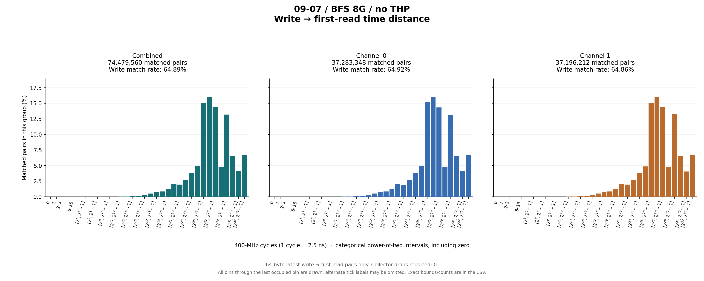
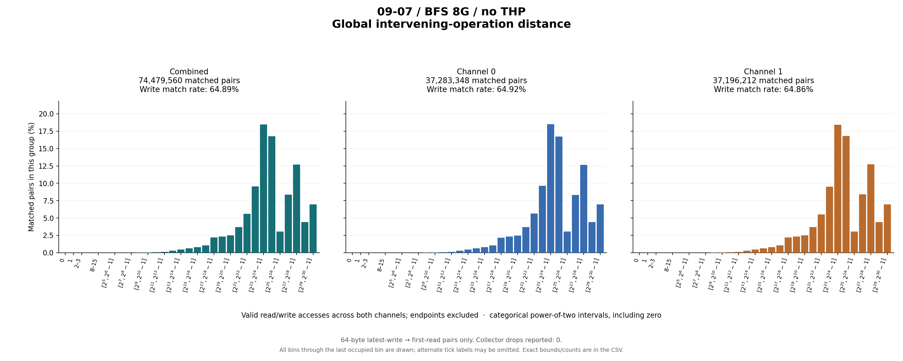

# 09-07 / BFS 8G / no THP

64-byte latest-write → first-read pairs only. Collector drops reported: 0.

## Write outcomes

| Group | Writes | Matched | Match rate | Superseded | Pending at end | Reads without pending write |
|---|---:|---:|---:|---:|---:|---:|
| combined | 114,780,925 | 74,479,560 | 64.89% | 1,172,195 | 39,129,170 | 666,193,403 |
| channel_0 | 57,432,243 | 37,283,348 | 64.92% | 579,289 | 19,569,606 | 332,221,213 |
| channel_1 | 57,348,682 | 37,196,212 | 64.86% | 592,906 | 19,559,564 | 333,972,190 |

## Matched-pair distances (combined)

| Metric | Exact minimum | Mean | Exact maximum | P50 interval | P90 interval | P95 interval | P99 interval |
|---|---:|---:|---:|---|---|---|---|
| time_cycles | 85 | 742,000,649.088 | 6,106,016,511 | [67,108,864, 134,217,727] | [2,147,483,648, 4,294,967,295] | [4,294,967,296, 8,589,934,591] | [4,294,967,296, 8,589,934,591] |
| intervening_operations | 0 | 105,908,120.193 | 853,022,326 | [16,777,216, 33,554,431] | [268,435,456, 536,870,911] | [536,870,912, 1,073,741,823] | [536,870,912, 1,073,741,823] |

Percentiles are nearest-rank **bin intervals**, not exact values. Histograms contain matched pairs only; write match rates include superseded and pending writes in the denominator.

Raw slots: 855,453,888; valid accesses: 855,453,888; invalid slots: 0.

Data: [summary JSON](summary.json), [summary CSV](summary.csv), [time bins](time_histogram.csv), [operation bins](intervening_operations_histogram.csv).

[Back to results](../README.md).

Original result directory: `/research/yans3/gitdoc/tracing_analysis/out/write_read_all_20260927_retry1/results/r1_trace_09_07_bfs_8g_noTHP_1d3fc83cc2`.
Input: `/research/yans3/trace/trace_09_07/bfs_8g_noTHP.bin`.
Input SHA-256: `c8e1c01e45f1046b41ae409492bca07b04ecc7c44ca382f68dbca258d2d6e775`.
