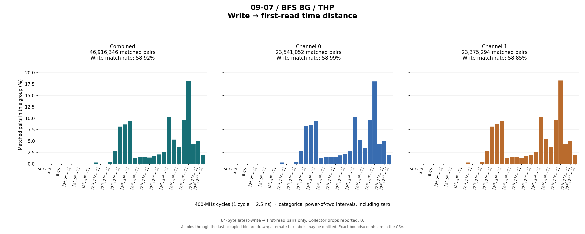
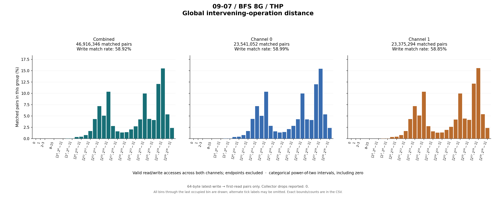

# 09-07 / BFS 8G / THP

64-byte latest-write → first-read pairs only. Collector drops reported: 0.

## Write outcomes

| Group | Writes | Matched | Match rate | Superseded | Pending at end | Reads without pending write |
|---|---:|---:|---:|---:|---:|---:|
| combined | 79,624,881 | 46,916,346 | 58.92% | 2,685 | 32,705,850 | 639,485,845 |
| channel_0 | 39,904,476 | 23,541,052 | 58.99% | 1,374 | 16,362,050 | 319,073,906 |
| channel_1 | 39,720,405 | 23,375,294 | 58.85% | 1,311 | 16,343,800 | 320,411,939 |

## Matched-pair distances (combined)

| Metric | Exact minimum | Mean | Exact maximum | P50 interval | P90 interval | P95 interval | P99 interval |
|---|---:|---:|---:|---|---|---|---|
| time_cycles | 32 | 494,437,754.134 | 5,165,060,921 | [33,554,432, 67,108,863] | [1,073,741,824, 2,147,483,647] | [2,147,483,648, 4,294,967,295] | [4,294,967,296, 8,589,934,591] |
| intervening_operations | 0 | 79,831,229.344 | 764,703,178 | [8,388,608, 16,777,215] | [134,217,728, 268,435,455] | [268,435,456, 536,870,911] | [536,870,912, 1,073,741,823] |

Percentiles are nearest-rank **bin intervals**, not exact values. Histograms contain matched pairs only; write match rates include superseded and pending writes in the denominator.

Raw slots: 766,027,072; valid accesses: 766,027,072; invalid slots: 0.

Data: [summary JSON](summary.json), [summary CSV](summary.csv), [time bins](time_histogram.csv), [operation bins](intervening_operations_histogram.csv).

[Back to results](../README.md).

Original result directory: `/research/yans3/gitdoc/tracing_analysis/out/write_read_all_20260927_retry1/results/r1_trace_09_07_bfs_8g_withTHP_467813de1b`.
Input: `/research/yans3/trace/trace_09_07/bfs_8g_withTHP.bin`.
Input SHA-256: `3f50ac856eb905974314684809985fd35367a51b3bcbe82360b27973fd4d7346`.
