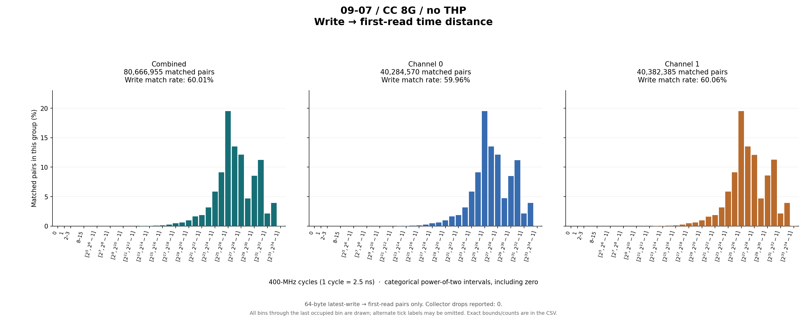
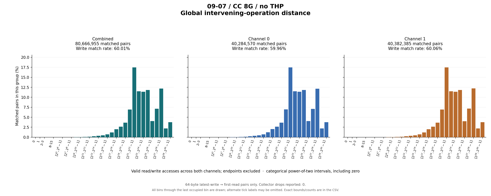

# 09-07 / CC 8G / no THP

64-byte latest-write → first-read pairs only. Collector drops reported: 0.

## Write outcomes

| Group | Writes | Matched | Match rate | Superseded | Pending at end | Reads without pending write |
|---|---:|---:|---:|---:|---:|---:|
| combined | 134,418,835 | 80,666,955 | 60.01% | 3,946 | 53,747,934 | 850,381,794 |
| channel_0 | 67,187,224 | 40,284,570 | 59.96% | 1,977 | 26,900,677 | 423,700,361 |
| channel_1 | 67,231,611 | 40,382,385 | 60.06% | 1,969 | 26,847,257 | 426,681,433 |

## Matched-pair distances (combined)

| Metric | Exact minimum | Mean | Exact maximum | P50 interval | P90 interval | P95 interval | P99 interval |
|---|---:|---:|---:|---|---|---|---|
| time_cycles | 85 | 639,940,693.522 | 9,077,676,763 | [67,108,864, 134,217,727] | [1,073,741,824, 2,147,483,647] | [2,147,483,648, 4,294,967,295] | [4,294,967,296, 8,589,934,591] |
| intervening_operations | 0 | 76,109,334.383 | 1,064,358,669 | [8,388,608, 16,777,215] | [134,217,728, 268,435,455] | [268,435,456, 536,870,911] | [536,870,912, 1,073,741,823] |

Percentiles are nearest-rank **bin intervals**, not exact values. Histograms contain matched pairs only; write match rates include superseded and pending writes in the denominator.

Raw slots: 1,065,467,584; valid accesses: 1,065,467,584; invalid slots: 0.

Data: [summary JSON](summary.json), [summary CSV](summary.csv), [time bins](time_histogram.csv), [operation bins](intervening_operations_histogram.csv).

[Back to results](../README.md).

Original result directory: `/research/yans3/gitdoc/tracing_analysis/out/write_read_all_20260927_retry1/results/r1_trace_09_07_cc_8g_noTHP_25fca2b541`.
Input: `/research/yans3/trace/trace_09_07/cc_8g_noTHP.bin`.
Input SHA-256: `7526e03c15905d1662516b6a7be1cd3e5ec8a16f5231cf1eef07f5ea97d965f0`.
