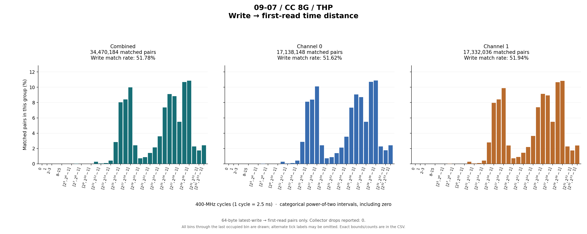
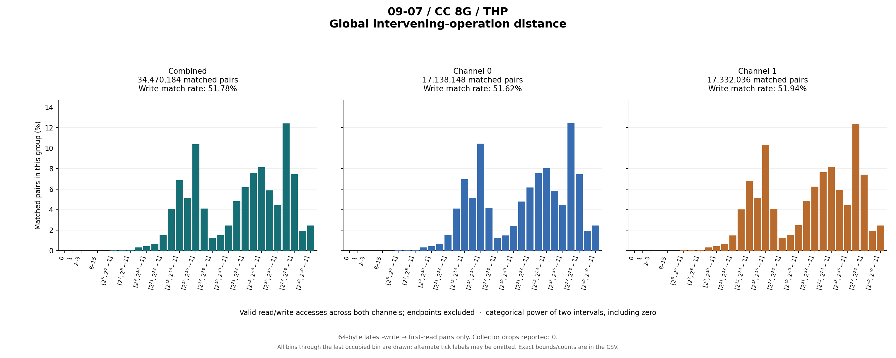

# 09-07 / CC 8G / THP

64-byte latest-write → first-read pairs only. Collector drops reported: 0.

## Write outcomes

| Group | Writes | Matched | Match rate | Superseded | Pending at end | Reads without pending write |
|---|---:|---:|---:|---:|---:|---:|
| combined | 66,567,679 | 34,470,184 | 51.78% | 1,640,653 | 30,456,842 | 727,191,449 |
| channel_0 | 33,199,915 | 17,138,148 | 51.62% | 817,204 | 15,244,563 | 362,222,994 |
| channel_1 | 33,367,764 | 17,332,036 | 51.94% | 823,449 | 15,212,279 | 364,968,455 |

## Matched-pair distances (combined)

| Metric | Exact minimum | Mean | Exact maximum | P50 interval | P90 interval | P95 interval | P99 interval |
|---|---:|---:|---:|---|---|---|---|
| time_cycles | 8 | 370,763,790.377 | 6,393,684,434 | [33,554,432, 67,108,863] | [536,870,912, 1,073,741,823] | [1,073,741,824, 2,147,483,647] | [4,294,967,296, 8,589,934,591] |
| intervening_operations | 0 | 55,242,228.330 | 827,675,081 | [4,194,304, 8,388,607] | [134,217,728, 268,435,455] | [134,217,728, 268,435,455] | [536,870,912, 1,073,741,823] |

Percentiles are nearest-rank **bin intervals**, not exact values. Histograms contain matched pairs only; write match rates include superseded and pending writes in the denominator.

Raw slots: 828,229,312; valid accesses: 828,229,312; invalid slots: 0.

Data: [summary JSON](summary.json), [summary CSV](summary.csv), [time bins](time_histogram.csv), [operation bins](intervening_operations_histogram.csv).

[Back to results](../README.md).

Original result directory: `/research/yans3/gitdoc/tracing_analysis/out/write_read_all_20260927_retry1/results/r1_trace_09_07_cc_8g_withTHP_484755becf`.
Input: `/research/yans3/trace/trace_09_07/cc_8g_withTHP.bin`.
Input SHA-256: `0011246164cdab5a0b4e42af9b4b8c0edf6d66e9ff0d782fa1dcf60827a8ba2e`.
