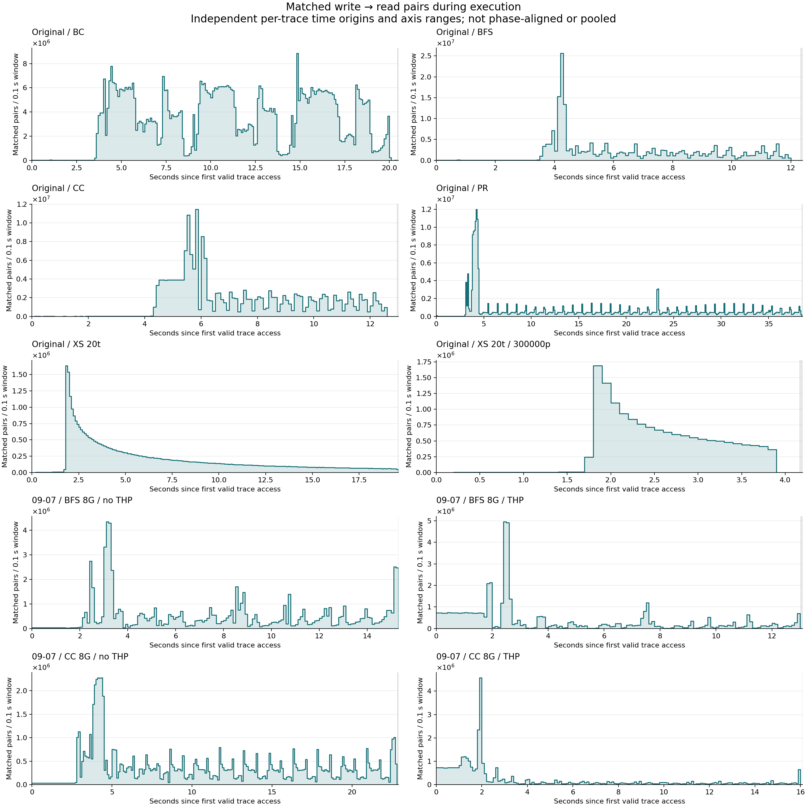

# Write-to-read execution timelines

10 distinct eligible traces, **0.1-second windows**. These are fresh raw-trace analyses; the prior histogram publication is unchanged.



## Per-trace results

| Trace / detailed plot | Observed span (s) | Matched pairs | Peak pairs/window | First peak window starts (s) | Collector drops |
|---|---:|---:|---:|---:|---:|
| [Original / BC](r0_bc_81b06a15ad/README.md) | 20.453 | 641,287,948 | 8,842,717 | 14.800 | 1,040 |
| [Original / BFS](r0_bfs_f5c070eb98/README.md) | 12.336 | 209,574,211 | 25,610,859 | 4.200 | 0 |
| [Original / CC](r0_cc_3cd2baf7ac/README.md) | 12.958 | 197,789,959 | 11,441,177 | 5.800 | 9,345 |
| [Original / PR](r0_pr_b8e5f78041/README.md) | 38.520 | 252,741,568 | 11,981,019 | 4.200 | 583,273,912 |
| [Original / XS 20t](r0_xs_20t_1fed27b3cc/README.md) | 19.584 | 37,376,293 | 1,639,217 | 1.800 | 742,705,516 |
| [Original / XS 20t / 300000p](r0_xs_20t_300000p_3868b65f34/README.md) | 4.167 | 14,939,301 | 1,692,933 | 1.800 | 0 |
| [09-07 / BFS 8G / no THP](r1_trace_09_07_bfs_8g_noTHP_1d3fc83cc2/README.md) | 15.299 | 74,479,560 | 4,354,560 | 3.100 | 0 |
| [09-07 / BFS 8G / THP](r1_trace_09_07_bfs_8g_withTHP_467813de1b/README.md) | 13.026 | 46,916,346 | 4,960,722 | 2.400 | 0 |
| [09-07 / CC 8G / no THP](r1_trace_09_07_cc_8g_noTHP_25fca2b541/README.md) | 22.842 | 80,666,955 | 2,279,695 | 4.100 | 0 |
| [09-07 / CC 8G / THP](r1_trace_09_07_cc_8g_withTHP_484755becf/README.md) | 16.091 | 34,470,184 | 4,576,555 | 1.900 | 0 |

## Definitions and limitations

- Time zero is each trace's first valid event; x is execution time, not write-to-read distance.
- A pair is assigned to the read-request window using integer cycle arithmetic. Writes can precede that window.
- The 64B latest-write/first-read policy is unchanged. Superseded and pending writes are not counted as pairs.
- CSVs also retain all reads/writes per window. Pair-count peaks may reflect more traffic, not higher reuse probability.
- Every occupied event bin has all three channel-group rows. Omitted bins are zero; plots preserve gaps.
- Gray tail shading is outside the observed span; a final partial window is not normalized to a full-window rate.
- Each overview panel has its own axis ranges. Workload phases are not aligned and timelines are not pooled.
- Collector drops cannot be localized or corrected from the aggregate header count. These are observed counts.

## Validation and coverage

Each timeline sums to the existing matched/read/write counters, and each bin's channel counts sum to combined. All prior histogram/provenance checks are also required before publication.

All **10 traces** have identical raw-file SHA-256 digests and matching/distance statistics to the baseline publication. Adding timelines did not change pairing results.

Coverage: **partial** across discovered input paths. 3 malformed inputs and 1 duplicate aliases remain excluded. All eligible distinct traces must finish; this publisher does not silently skip failed tasks.

[Coverage details](coverage.json) · [All timeline summaries](timeline_summary.csv) · [Provenance](provenance.json) · [Launch snapshot](source_manifest.json).

## Reproduce locally

```sh
python3 scripts/plot_execution_timeline.py \
  --run-dir /research/yans3/gitdoc/tracing_analysis/out/write_read_timeline_20260927_v1 \
  --output docs/results/execution_timeline_NEW
```

No Slurm or raw-bin access is needed for plotting. Existing publications are never overwritten. The CSVs can be summed into integer multiples of the base window without reparsing; finer windows need a new analysis.
