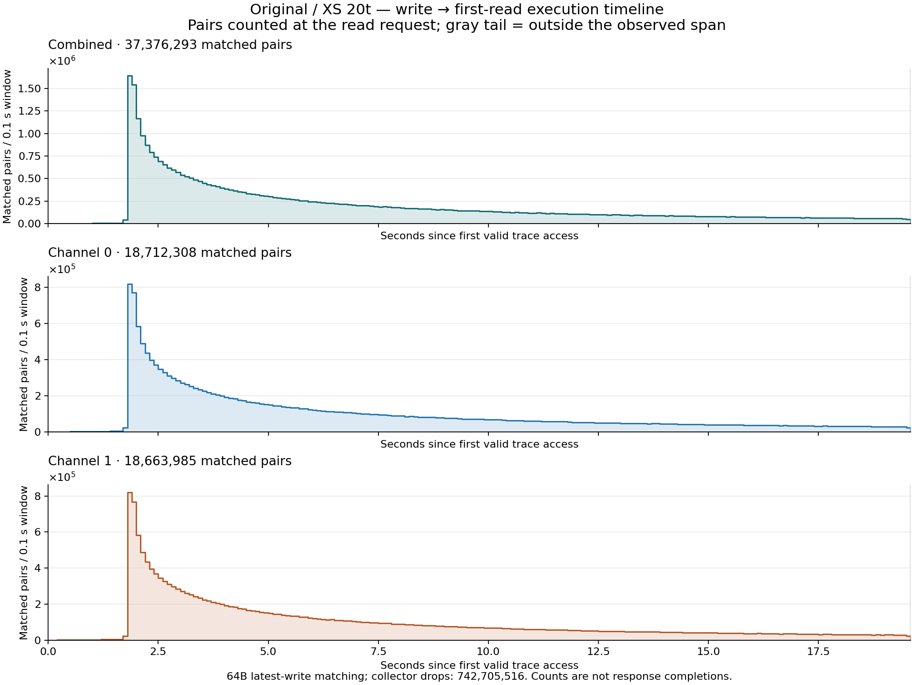

# Original / XS 20t: execution timeline

Each 0.1-second half-open window counts pairs at the read request. Time zero is the first valid trace event, shared by both channels. Pending writes survive windows. Gray shading marks the unobserved tail after the last valid timestamp (one tick included).

Collector reports **742,705,516 dropped records**; their time locations are unknown. An observed zero is not proof of inactivity if capture dropped events.

[Timeline counts and read/write context](execution_timeline.csv) · [Timeline summary](timeline_summary.csv) · [Original statistics and time bounds](summary.json).

CSV offsets are cycles at 400 MHz. Only occupied event bins are stored; omitted bins within the recorded span have zero observed events. Counts are not response completions, service latencies, or the probability a write will be read.
